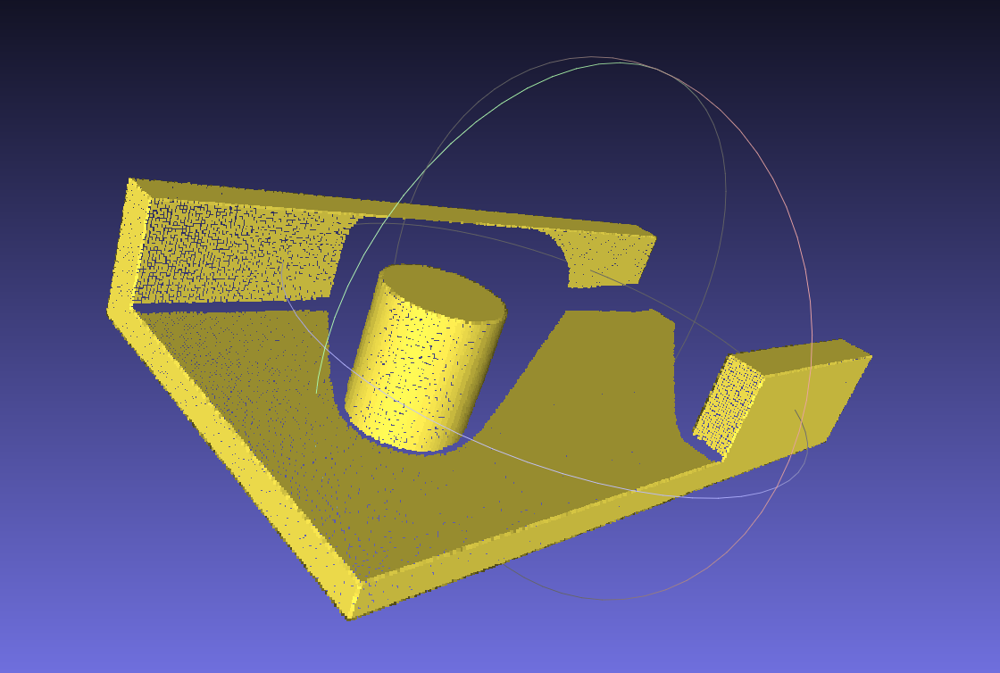
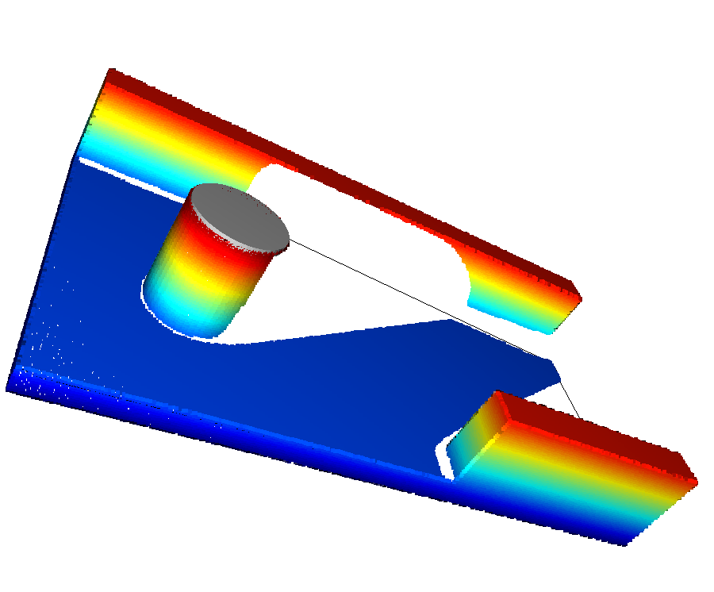

# 円筒軸算出例

底面のエッジと円筒軸の距離を算出する例

## インストール

```sh
pip install -r requirements.txt
```

## 実行

```sh
python main.py
```

## サンプルデータ

- 円柱中心: (49.0, 52.0)
- 円柱半径: 17.5
- 円柱高さ: 40.0
- エッジ面: 122.0



## 結果

- 円筒中心: [48.96764445 51.9543532 49.48297991]
- 円筒半径: 17.429765585987788
- 円筒軸と各エッジ間の距離: ['78.56', '201.19', '51.97', '51.96', '51.95', '47.45', '47.49', '45.89']


